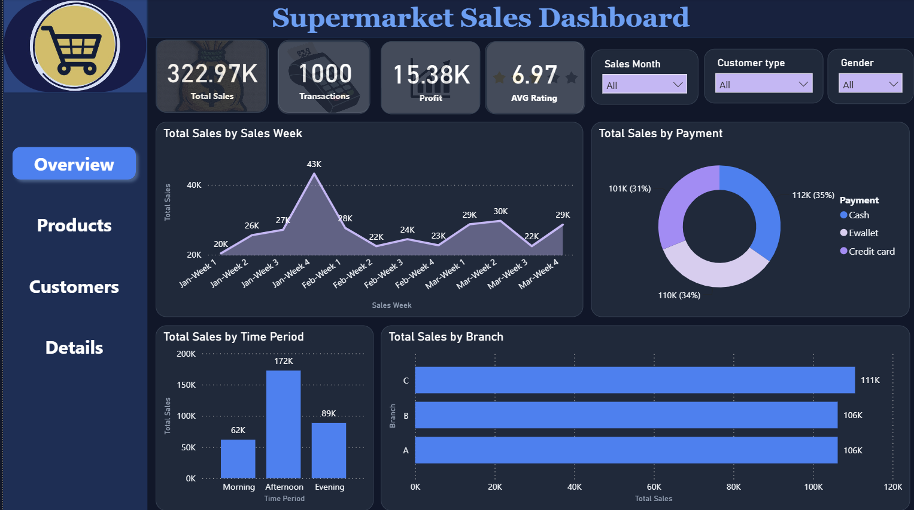
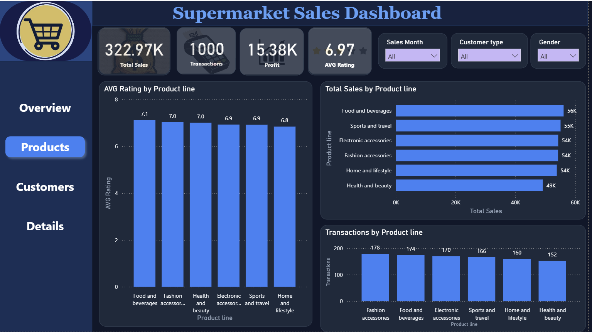
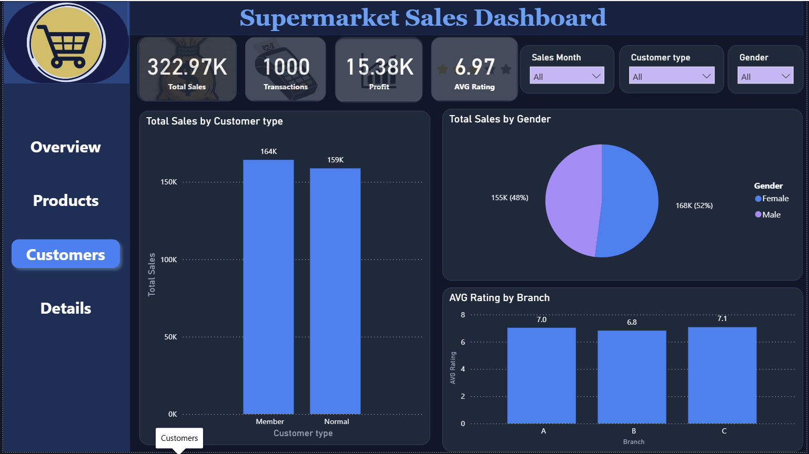
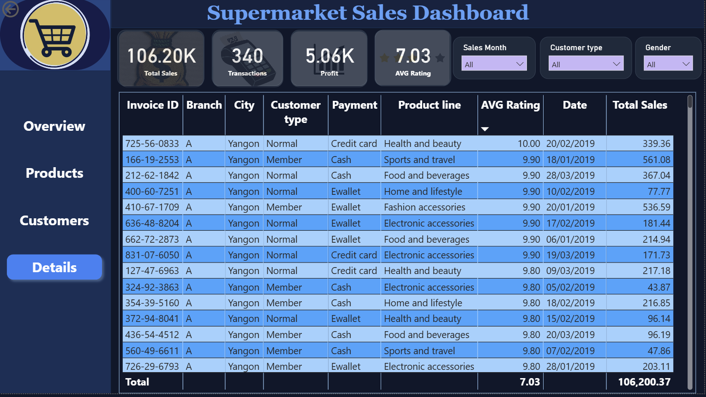

# 🛒 Supermarket Sales Dashboard

An interactive **Supermarket Sales Dashboard** developed using **Microsoft Power BI** to analyze sales performance, profitability, customer purchasing behavior, product categories, and regional performance.

The dashboard transforms raw supermarket sales data into meaningful business insights through interactive visualizations, KPIs, filters, and analytical views.

---

## 📊 Dashboard Preview

 
 
 
 

---

## 📌 Project Overview

The **Supermarket Sales Dashboard** is a Business Intelligence and Data Visualization project created to provide a comprehensive overview of supermarket sales performance.

The dashboard enables users to monitor key performance indicators, analyze sales trends, compare product categories, evaluate regional performance, and identify patterns in customer purchasing behavior.

The project demonstrates the use of **Power BI, Power Query, DAX, data modeling, and interactive data visualization** to convert raw transactional data into an easy-to-understand business reporting solution.

---

## 🎯 Project Objectives

The main objectives of this project are to:

- Analyze overall supermarket sales performance.
- Monitor key sales and profitability KPIs.
- Identify high-performing product categories.
- Analyze sales performance across different regions.
- Understand customer purchasing patterns.
- Evaluate payment methods and transaction behavior.
- Analyze sales trends over time.
- Identify areas of strong and weak business performance.
- Present business insights through an interactive Power BI dashboard.

---

## 🗂️ Dataset

The project uses a supermarket sales dataset containing transactional-level sales information.

The dataset includes information related to:

- Invoice / Transaction details
- Branch
- City
- Customer type
- Gender
- Product line
- Unit price
- Quantity
- Tax
- Total sales
- Date
- Time
- Payment method
- Cost of goods sold
- Gross income
- Gross margin percentage
- Customer rating

The dataset provides sufficient information to analyze sales, customer behavior, product performance, and profitability.

---

## 📈 Key Performance Indicators (KPIs)

The dashboard provides an overview of important business performance indicators, including:

- 💰 **Total Sales**
- 📦 **Total Quantity Sold**
- 💵 **Gross Income**
- 🧾 **Total Transactions**
- ⭐ **Average Customer Rating**

These KPIs provide a quick summary of the supermarket's overall performance.

---

## 📊 Dashboard Analysis

### 1. Sales Performance Analysis

The dashboard analyzes overall sales performance and helps identify changes and patterns in sales over time.

Key areas include:

- Total sales
- Sales trends
- Sales by branch
- Sales by city
- Sales by product line
- Sales performance across different periods

---

### 2. Product Category Analysis

The dashboard evaluates the performance of different product lines.

This analysis helps identify:

- Best-performing product categories
- Categories generating higher sales
- Categories contributing more to gross income
- Product categories with lower performance

This information can support inventory planning, product promotion, and sales strategy decisions.

---

### 3. Branch & Regional Analysis

Sales performance is compared across different supermarket branches and cities.

The analysis helps answer questions such as:

- Which branch generates the highest sales?
- Which city performs best?
- How does profitability differ between branches?
- Which locations require additional attention?

---

### 4. Customer Analysis

Customer-related information is analyzed to understand purchasing behavior.

The dashboard considers:

- Customer type
- Gender
- Product preferences
- Purchase patterns
- Customer ratings

This can help businesses better understand their customer base and improve customer-focused strategies.

---

### 5. Payment Method Analysis

The dashboard provides an overview of customer payment preferences.

Payment methods can be compared to identify:

- Most frequently used payment methods
- Payment method distribution
- Differences in purchasing behavior based on payment method

---

### 6. Time-Based Analysis

The dashboard analyzes sales according to time-related dimensions.

This allows users to identify:

- Sales trends
- High-performing periods
- Daily purchasing patterns
- Changes in sales performance over time

---

## 🔍 Key Business Questions

The dashboard is designed to answer important business questions such as:

1. What is the overall sales performance?
2. Which product line generates the highest sales?
3. Which branch performs the best?
4. Which city generates the highest revenue?
5. What are the most common payment methods?
6. Which customer groups contribute most to sales?
7. How does sales performance change over time?
8. Which product categories generate higher gross income?
9. What are the customer rating patterns?
10. Which areas of the business require further improvement?

---

## 🛠️ Tools & Technologies

| Tool | Purpose |
|---|---|
| **Microsoft Power BI** | Dashboard development and data visualization |
| **Power Query** | Data cleaning and transformation |
| **DAX** | KPI calculations and analytical measures |
| **Microsoft Excel / CSV** | Data source and initial data preparation |

---

## 🔄 Data Analysis Process

The project follows a structured data analytics workflow:

```text
Raw Dataset
     ↓
Data Cleaning
     ↓
Data Transformation
     ↓
Data Modeling
     ↓
DAX Calculations
     ↓
Interactive Visualizations
     ↓
Business Insights
